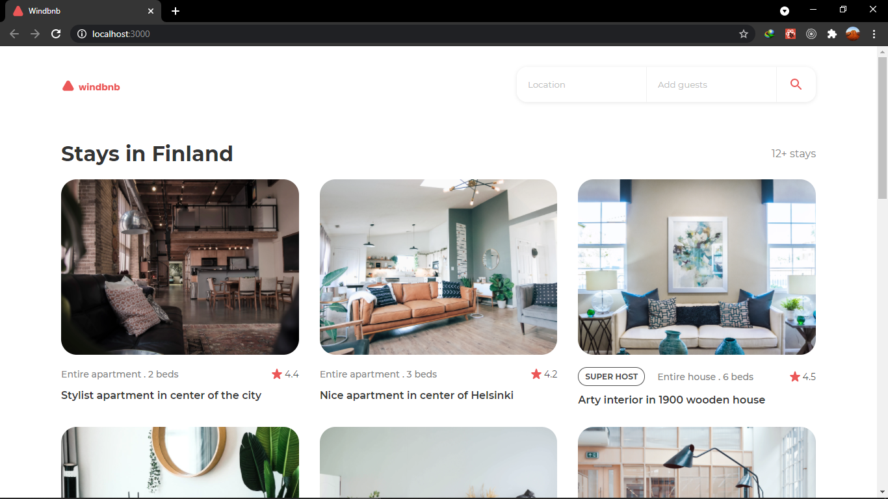

<h1 align="center">Windbnb React</h1>

<div align="center">
   Solution for a challenge from  <a href="http://devchallenges.io" target="_blank">Devchallenges.io</a>.
</div>

<div align="center">
  <h3>
    <a href="https://windbnb-kelvin.netlify.app">
      Demo
    </a>
    <span> | </span>
    <a href="#">
      Solution
    </a>
    <span> | </span>
    <a href="https://devchallenges.io/challenges/3JFYedSOZqAxYuOCNmYD">
      Challenge
    </a>
  </h3>
</div>

<!-- TABLE OF CONTENTS -->

## Table of Contents

-   [Overview](#overview)
    -   [Built With](#built-with)
-   [Features](#features)
-   [How to use](#how-to-use)
-   [Contact](#contact)
-   [Acknowledgements](#acknowledgements)

<!-- OVERVIEW -->

## Overview



-   My experience
    -   I enjoyed replicating the Figma designs of the project into actual code, and deploying the
        interactive, responsive site.
-   What I learnt/improved
    -   I have improved on planning and organising my code. I even got to work with Typescript for the first
        time and noticed a major improvement in error checking and intellisense.
-   My thought
    -   Nothing is impossible, get your attitude right, strive and change that to I'm possible ;)

### Built With

-   [React](https://reactjs.org/)
-   [Typescript](https://www.typescriptlang.org/)
-   [Styled components](https://www.styled-components.com/)

## Features

<!-- List the features of your application or follow the template. Don't share the figma file here :) -->

This application/site was created as a submission to a [DevChallenges](https://devchallenges.io/challenges) challenge. The [challenge](https://devchallenges.io/challenges/3JFYedSOZqAxYuOCNmYD) was to build an application to complete the given user stories.

## How To Use

<!-- Example: -->

To clone and run this application, you'll need [Git](https://git-scm.com) and [Node.js](https://nodejs.org/en/download/) (which comes with [npm](http://npmjs.com)) installed on your computer. From your command line:

```bash
# Clone this repository
$ git clone https://github.com/K-Kelvin/windbnb-react

# Install dependencies
$ npm install

# Run the app
$ npm start
```

## Acknowledgements

<!-- This section should list any articles or add-ons/plugins that helps you to complete the project. This is optional but it will help you in the future. For example: -->

-   [Steps to replicate a design with only HTML and CSS](https://devchallenges-blogs.web.app/how-to-replicate-design/)
-   [Node.js](https://nodejs.org/)
<!-- -   [Marked - a markdown parser](https://github.com/chjj/marked) -->

## Contact

-   Website [Windbnb](https://windbnb-kelvin.netlify.app)
-   GitHub [@K-Kelvin](https://github.com/K-Kelvin)
-   Twitter [@k_kijanda](https://twitter.com/k_kijanda)
